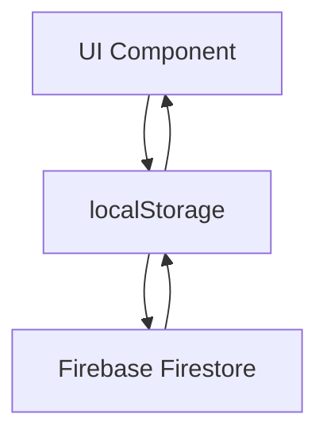
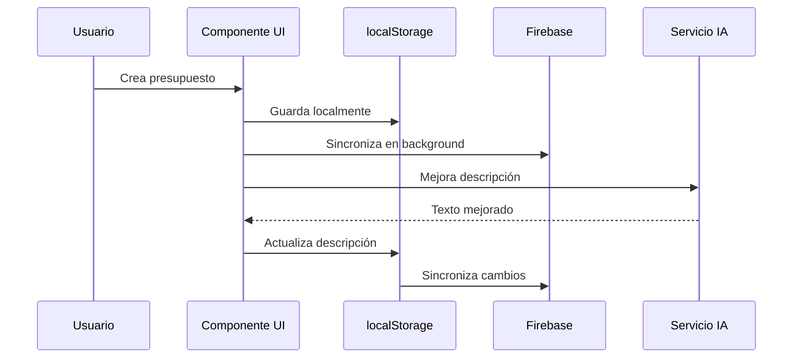
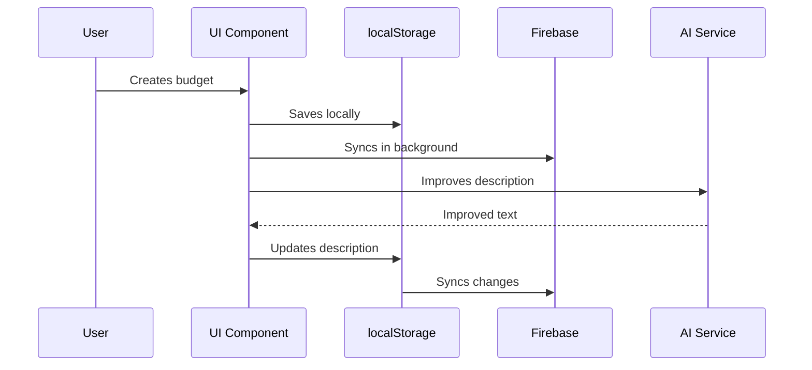

# 🌐 PRESUPUESTOS - Sistema Multi-ERP de Gestión de Presupuestos

## 🌐 Language Selection | Selección de Idioma

<details>
<summary>🇪🇸 Español</summary>

# PRESUPUESTOS - Sistema Multi-ERP de Gestión de Presupuestos

Plataforma web moderna para la creación y gestión de presupuestos/cotizaciones con soporte multi-ERP (Ágora, Sage) e integración con IA para generación de contenido.

## 📋 Tabla de Contenidos
- [Descripción](#descripción)
- [Características Principales](#características-principales)
- [Arquitectura del Sistema](#arquitectura-del-sistema)
- [Instalación](#instalación)
- [Configuración](#configuración)
- [Guía de Usuario](#guía-de-usuario)
- [API Reference](#api-reference)
- [Contribución](#contribución)
- [Troubleshooting](#troubleshooting)

### 📖 Descripción

PRESUPUESTOS es una aplicación web moderna para la creación y gestión de presupuestos/cotizaciones con soporte multi-ERP. Diseñada para empresas que trabajan con múltiples sistemas ERP como Ágora Retail y Sage, permite una gestión centralizada de presupuestos con personalización por sistema.

### 🚀 Características Principales

#### 🎯 Gestión de Presupuestos
- **Editor completo**: Formularios dinámicos para datos de cliente y documento
- **Búsqueda inteligente**: Selector con búsqueda difusa para clientes y productos
- **Navegación rápida**: Paleta de comandos con atajos de teclado

#### 🏢 Multi-ERP
- **Sistemas soportados**: Ágora Retail, Sage 50, Sage 200, Sage Despachos
- **Personalización por sistema**: Configuración independiente de colores, logos y textos
- **Filtrado automático**: Productos y presupuestos se filtran según el sistema activo

#### 🎨 Diseño y UX
- **Temas múltiples**: Classic, Ocean, Midnight
- **Interfaz adaptable**: Responsive design con sidebar colapsable
- **Animaciones fluidas**: Transiciones con Framer Motion

#### 🔐 Seguridad
- **Autenticación robusta**: Sistema de login con hash de contraseñas
- **Rotación de contraseñas**: Cambio obligatorio cada 15 días
- **Roles de usuario**: Admin y Commercial con permisos diferenciados

#### 🤖 Inteligencia Artificial
- **Generación de contenido**: Mejora automática de descripciones con IA
- **Asistente de ventas**: Sugerencias basadas en historial

### 🏗️ Arquitectura del Sistema

#### Patrón Local-First Sync


El sistema utiliza un patrón de sincronización dual:
1. **Local First**: Datos guardados inmediatamente en localStorage para respuesta instantánea
2. **Cloud Sync**: Sincronización en segundo plano con Firebase

#### Estructura de Componentes
```
src/
├── components/
│   ├── BudgetEditor.tsx      # Editor principal de presupuestos
│   ├── Layout.tsx           # Layout principal con sidebar
│   ├── SearchableSelect.tsx # Selector con búsqueda
│   ├── CommandPalette.tsx   # Paleta de comandos
│   ├── PdfCustomizer.tsx    # Personalización de PDFs
│   ├── ProductManager.tsx   # Gestión de productos
│   ├── Settings.tsx         # Configuración
│   └── Login.tsx           # Autenticación
├── services/
│   ├── storage.ts          # Persistencia de datos
│   ├── auth.ts            # Servicios de autenticación
│   ├── ai.ts              # Integración con IA
│   └── pdfGenerator.ts    # Generación de PDFs
└── types.ts               # Definiciones TypeScript
```

#### Flujo de Datos


### 🛠️ Instalación

#### Prerrequisitos
- Node.js 18.0 o superior
- npm o yarn
- Cuenta de Google Firebase (opcional para sincronización)

#### Pasos de Instalación

1. **Clonar el repositorio**
```bash
git clone https://github.com/ibim4ster/PRESUPUESTOS-.git
cd PRESUPUESTOS-
```

2. **Instalar dependencias**
```bash
npm install
# o
yarn install
```

3. **Configurar variables de entorno**
```bash
cp .env.example .env.local
```

Editar `.env.local` con tus configuraciones:
```env
VITE_FIREBASE_API_KEY=tu_api_key
VITE_FIREBASE_AUTH_DOMAIN=tu_proyecto.firebaseapp.com
VITE_FIREBASE_PROJECT_ID=tu_proyecto_id
VITE_GEMINI_API_KEY=tu_gemini_api_key
```

4. **Iniciar aplicación**
```bash
npm run dev
# o
yarn dev
```

5. **Acceder a la aplicación**
Abre `http://localhost:5173` en tu navegador

### ⚙️ Configuración

#### Configuración Inicial

1. **Acceso por primera vez**
   - Usuario: `admin`
   - Contraseña: `admin`
   - Se solicitará cambiar la contraseña en el primer inicio

2. **Configurar empresa**
   - Navega a `Ajustes > Datos Fiscales`
   - Completa la información de tu empresa
   - Sube el logo (opcional)

3. **Configurar sistemas ERP**
   - En `Ajustes > Diseño PDF` configura cada sistema
   - Personaliza colores, textos y logos por sistema

#### Configuración de Firebase (Opcional)

Para habilitar la sincronización en la nube:

1. Crea un proyecto en [Firebase Console](https://console.firebase.google.com/)
2. Habilita Firestore Database
3. Copia las credenciales a `.env.local`
4. En la aplicación, ve a `Ajustes > Sincronización en la Nube`
5. Activa la sincronización y prueba la conexión

### 📚 Guía de Usuario

#### Crear un Presupuesto

1. **Seleccionar sistema**
   - Usa el selector en el sidebar: `Ágora Retail`, `Sage 50`, etc.

2. **Nuevo presupuesto**
   - Click en `Nuevo Presupuesto` en el menú
   - Completa los datos del cliente usando el buscador
   - Añade productos desde el catálogo

3. **Personalizar documento**
   - Configura validez, términos de pago
   - Añade notas internas
   - Usa IA para mejorar descripciones

4. **Generar PDF**
   - Click en `Generar PDF`
   - El documento se generará con la configuración del sistema activo

#### Gestión de Productos

1. **Acceso al catálogo**
   - Navega a `Catálogo` en el menú

2. **Importar productos**
   - Descarga la plantilla CSV
   - Completa con tus productos
   - Importa usando el botón `Importar CSV`

3. **Configurar productos**
   - Asigna cada producto a un sistema ERP
   - Define precios, stock y márgenes
   - Usa IA para generar descripciones

#### Atajos de Teclado

- `Ctrl/Cmd + K`: Abrir paleta de comandos
- `ESC`: Cerrar diálogos
- `Ctrl/Cmd + S`: Guardar (en formularios)

### 🔧 API Reference

#### Servicios Principales

##### storageService
Servicio de persistencia de datos con patrón local-first

```typescript
// Guardar presupuesto
storageService.saveBudget(budget);

// Obtener presupuestos del sistema actual
const budgets = storageService.getBudgets().filter(b => b.system === currentSystem);

// Suscribir a cambios
const unsubscribe = storageService.subscribe(() => {
  // Actualizar UI cuando cambian los datos
});
```

##### authService
Servicio de autenticación y gestión de usuarios

```typescript
// Iniciar sesión
const user = await authService.login(username, password);

// Verificar si es admin
const isAdmin = authService.isAdmin(user);

// Cerrar sesión
authService.logout();
```

#### Tipos de Datos

##### Budget
```typescript
interface Budget {
  id: string;
  number: string;
  status: 'draft' | 'pending' | 'accepted' | 'rejected';
  clientId: string;
  clientData: Client;
  system: SystemType;
  lineItems: LineItem[];
  // ... más campos
}
```

##### SystemType
```typescript
type SystemType = 'agora' | 'sage' | 'sage200' | 'sagedespachos';
```

### 🤝 Contribución

#### Flujo de Trabajo

1. **Fork del repositorio**
2. **Crear rama de feature**
```bash
git checkout -b feature/nueva-funcionalidad
```

3. **Realizar cambios**
   - Sigue las convenciones de código existentes
   - Añade tests si es necesario
   - Actualiza la documentación

4. **Commit de cambios**
```bash
git commit -m "feat: añadir nueva funcionalidad"
```

5. **Push y Pull Request**
```bash
git push origin feature/nueva-funcionalidad
```

#### Guía de Estilo

- **Componentes**: Usa TypeScript y React hooks
- **Estilos**: Tailwind CSS con variables CSS para temas
- **Nomenclatura**: camelCase para variables, PascalCase para componentes
- **Comentarios**: JSDoc para funciones importantes

### 🔍 Troubleshooting

#### Problemas Comunes

**Error: "No se puede conectar a Firebase"**
- Verifica las credenciales en `.env.local`
- Asegúrate que Firestore esté habilitado
- Revisa las reglas de seguridad de Firestore

**Error: "Contraseña incorrecta"**
- Verifica el usuario y contraseña
- Si es primer uso, usa `admin`/`admin`
- Solicita reset al administrador

**Error: "Los productos no aparecen"**
- Verifica el sistema ERP seleccionado
- Revisa que los productos estén asignados al sistema correcto
- Importa productos si el catálogo está vacío

#### Depuración

1. **Consola del navegador**
   - Revisa errores en la pestaña Console
   - Usa las DevTools para inspeccionar componentes

2. **Logs de la aplicación**
   - Los logs se guardan en localStorage
   - Accede via `storageService.getLogs()`

3. **Estado de sincronización**
   - En `Ajustes > Sincronización` prueba la conexión
   - Revisa el estado de Firebase

</details>

<details>
<summary>🇬🇧 English</summary>

# PRESUPUESTOS - Multi-ERP Budget Management System

Modern web application for creating and managing budgets/quotes with multi-ERP support (Ágora, Sage) and AI integration for content generation.

## 📋 Table of Contents
- [Description](#description)
- [Key Features](#key-features)
- [System Architecture](#system-architecture)
- [Installation](#installation)
- [Configuration](#configuration)
- [User Guide](#user-guide)
- [API Reference](#api-reference)
- [Contributing](#contributing)
- [Troubleshooting](#troubleshooting)

### 📖 Description

PRESUPUESTOS is a modern web application for creating and managing budgets/quotes with multi-ERP support. Designed for companies working with multiple ERP systems like Ágora Retail and Sage, it enables centralized budget management with system-specific customization.

### 🚀 Key Features

#### 🎯 Budget Management
- **Complete editor**: Dynamic forms for client and document data
- **Smart search**: Fuzzy search selector for clients and products
- **Quick navigation**: Command palette with keyboard shortcuts

#### 🏢 Multi-ERP
- **Supported systems**: Ágora Retail, Sage 50, Sage 200, Sage Despachos
- **System-specific customization**: Independent configuration of colors, logos, and texts
- **Automatic filtering**: Products and budgets filter based on active system

#### 🎨 Design & UX
- **Multiple themes**: Classic, Ocean, Midnight
- **Adaptive interface**: Responsive design with collapsible sidebar
- **Smooth animations**: Transitions with Framer Motion

#### 🔐 Security
- **Robust authentication**: Login system with password hashing
- **Password rotation**: Mandatory change every 15 days
- **User roles**: Admin and Commercial with differentiated permissions

#### 🤖 Artificial Intelligence
- **Content generation**: Automatic improvement of descriptions with AI
- **Sales assistant**: Suggestions based on history

### 🏗️ System Architecture

#### Local-First Sync Pattern


The system uses a dual synchronization pattern:
1. **Local First**: Data saved immediately to localStorage for instant response
2. **Cloud Sync**: Background synchronization with Firebase

#### Component Structure
```
src/
├── components/
│   ├── BudgetEditor.tsx      # Main budget editor
│   ├── Layout.tsx           # Main layout with sidebar
│   ├── SearchableSelect.tsx # Searchable selector
│   ├── CommandPalette.tsx   # Command palette
│   ├── PdfCustomizer.tsx    # PDF customization
│   ├── ProductManager.tsx   # Product management
│   ├── Settings.tsx         # Settings
│   └── Login.tsx           # Authentication
├── services/
│   ├── storage.ts          # Data persistence
│   ├── auth.ts            # Authentication services
│   ├── ai.ts              # AI integration
│   └── pdfGenerator.ts    # PDF generation
└── types.ts               # TypeScript definitions
```

#### Data Flow


### 🛠️ Installation

#### Prerequisites
- Node.js 18.0 or higher
- npm or yarn
- Google Firebase account (optional for synchronization)

#### Installation Steps

1. **Clone repository**
```bash
git clone https://github.com/ibim4ster/PRESUPUESTOS-.git
cd PRESUPUESTOS-
```

2. **Install dependencies**
```bash
npm install
# or
yarn install
```

3. **Configure environment variables**
```bash
cp .env.example .env.local
```

Edit `.env.local` with your configurations:
```env
VITE_FIREBASE_API_KEY=your_api_key
VITE_FIREBASE_AUTH_DOMAIN=your_project.firebaseapp.com
VITE_FIREBASE_PROJECT_ID=your_project_id
VITE_GEMINI_API_KEY=your_gemini_api_key
```

4. **Start application**
```bash
npm run dev
# or
yarn dev
```

5. **Access application**
Open `http://localhost:5173` in your browser

### ⚙️ Configuration

#### Initial Configuration

1. **First time access**
   - Username: `admin`
   - Password: `admin`
   - Will be prompted to change password on first login

2. **Configure company**
   - Navigate to `Settings > Tax Data`
   - Complete your company information
   - Upload logo (optional)

3. **Configure ERP systems**
   - In `Settings > PDF Design` configure each system
   - Customize colors, texts, and logos per system

#### Firebase Configuration (Optional)

To enable cloud synchronization:

1. Create a project at [Firebase Console](https://console.firebase.google.com/)
2. Enable Firestore Database
3. Copy credentials to `.env.local`
4. In the application, go to `Settings > Cloud Sync`
5. Enable synchronization and test connection

### 📚 User Guide

#### Creating a Budget

1. **Select system**
   - Use the selector in sidebar: `Ágora Retail`, `Sage 50`, etc.

2. **New budget**
   - Click `New Budget` in menu
   - Complete client data using search
   - Add products from catalog

3. **Customize document**
   - Configure validity, payment terms
   - Add internal notes
   - Use AI to improve descriptions

4. **Generate PDF**
   - Click `Generate PDF`
   - Document will be generated with active system configuration

#### Product Management

1. **Access catalog

Wiki pages you might want to explore:
- [Glossary (ibim4ster/PRESUPUESTOS-)](/wiki/ibim4ster/PRESUPUESTOS-#7)
